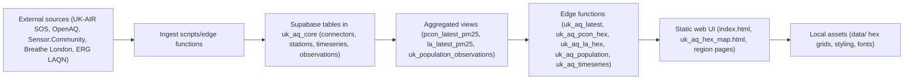

Below is the concrete “ingest → database → edge functions → website” flow as it exists in this workspace, with pointers to the exact files.

**Flow Summary**
1. **Ingest scripts and edge functions pull external data sources and write into Supabase.**  
   The ingest repo is `CIC-test-uk-aq-ingest`. A Cloudflare cron calls `uk_aq_dispatch_polls`, which triggers ingest functions for each connector (UK-AIR SOS, OpenAQ, Sensor.Community, Breathe London, ERG LAQN). These write into core tables like `connectors`, `stations`, `phenomena`, `timeseries`, `observations`, and membership/reference tables.  
   Files: `CIC-test-uk-aq-ingest/system_docs/uk_aq_edge_functions.md`, `CIC-test-uk-aq-ingest/system_docs/sos_ingest_flow.md`

2. **Supabase schema and views define how raw data is structured and aggregated.**  
   The schema is defined in the schema repo; edge functions query the `uk_aq_core` schema and views such as `pcon_latest_pm25` and `la_latest_pm25`.  
   Files: `CIC-Test-UK-AQ-Schema/uk-aq-schema/schemas/uk_aq_core_schema.sql`, `CIC-Test-UK-AQ-Schema/uk-aq-schema/schemas/uk_aq_public_views.sql` (if present), `LIVE-uk-air-quality-networks/system_docs/schema-overview.md`

3. **Edge functions expose read-only APIs for the website.**  
   These functions use the Supabase service role key to query PostgREST and return JSON.  
   Files:  
   `CIC-test-uk-aq-ingest/supabase/functions/uk_aq_latest/index.ts`  
   `CIC-test-uk-aq-ingest/supabase/functions/uk_aq_pcon_hex/index.ts`  
   `CIC-test-uk-aq-ingest/supabase/functions/uk_aq_la_hex/index.ts`  
   `CIC-test-uk-aq-ingest/supabase/functions/uk_aq_timeseries/index.ts`  
   `CIC-test-uk-aq-ingest/supabase/functions/uk_aq_bristol_latest/index.ts`  
   `CIC-test-uk-aq-ingest/supabase/functions/uk_aq_surbiton_latest/index.ts`

4. **Population data follows a parallel ingest → view → edge-function path.**  
   The population ingest repo writes to population tables/views and exposes `uk_aq_population`, which reads `uk_population_observations`.  
   Files:  
   `CIC UK Population Ingest/CIC-Test-uk-population-ingest/README.md`  
   `CIC UK Population Ingest/CIC-Test-uk-population-ingest/supabase/functions/uk_aq_population/index.ts`  
   `CIC-Test-UK-AQ-Schema/uk-aq-schema/schemas/uk_aq_pop_schema.sql`

5. **The static website fetches those edge functions with an anon key.**  
   The HTML pages are static and call `https://<project_ref>.supabase.co/functions/v1/<function>` endpoints. They do not call `/rest/v1` directly.  
   Files:  
   `CIC UK-AQ Webpage/CIC-test-uk-aq/uk_aq_hex_map.html`  
   `CIC UK-AQ Webpage/CIC-test-uk-aq/index.html`  
   `CIC UK-AQ Webpage/CIC-test-uk-aq/README_CROSS_REPO.md`  
   `CIC UK-AQ Webpage/CIC-test-uk-aq/scripts/uk_aq_inject_project_ref.mjs`

**Concrete Example: PM2.5 reading to hex map**
1. `ingest_sos` (or other connector) writes `observations` and updates `timeseries.last_value` in Supabase.  
   File: `CIC-test-uk-aq-ingest/system_docs/uk_aq_edge_functions.md`

2. The `pcon_latest_pm25` view (in `uk_aq_core`) aggregates latest values by constituency.  
   File: `CIC-test-uk-aq-ingest/supabase/functions/uk_aq_pcon_hex/index.ts`

3. `uk_aq_pcon_hex` returns those aggregates over the edge function API.  
   File: `CIC-test-uk-aq-ingest/supabase/functions/uk_aq_pcon_hex/index.ts`

4. `uk_aq_hex_map.html` fetches the edge function using the injected project ref and anon key, and combines it with local hex geometry in `data/`.  
   File: `CIC UK-AQ Webpage/CIC-test-uk-aq/uk_aq_hex_map.html`

**Mermaid Overview**

If you want, I can also trace one specific page end-to-end (e.g., `index.html` or `uk_aq_hex_map.html`) and list every API call and table/view it touches.